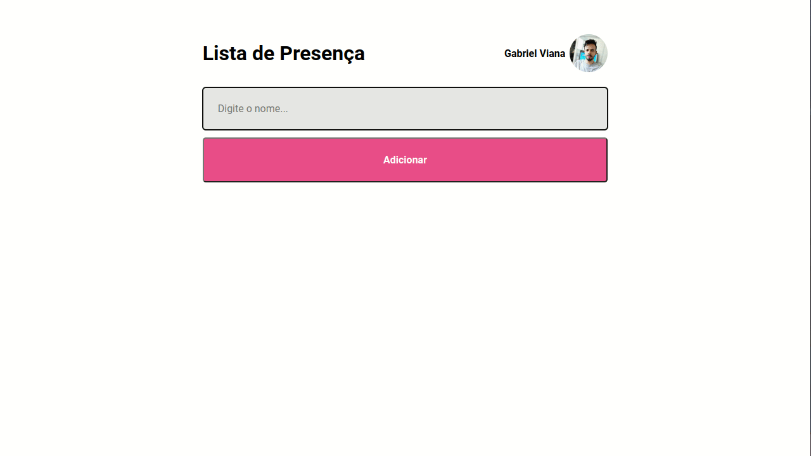

  
  
  
  
  
  
	
  
  
  

  

# Controle de presença

## ✒️ Descrição
Aplicativo desenvolvido na aula de React da _Trilha Especializar_ da Rocketseat, o intuito dessa aplicação e aprender os fundamentos do React. O objetivo desse aplicativo e gravar em uma lista os nomes é o horário das pessoas presentes.

## 🚀 Tecnologias utilizadas

 
  
  
  
  
  

  
  

## 📷 Demostração
Apresentação da tela do aplicativo.

  

## 🔥 Instalação
Clone o repositório.
~~~
git clone https://github.com/vian4dev/app-presenca.git
~~~
Acesse o diretório do projeto.
~~~
cd app-presenca/
~~~
Instale as dependências.
~~~
npm install
~~~
Execute a aplicação.
~~~
npm run dev
~~~

## 📝 Licença
Esse projeto está sob a licença MIT. Veja o arquivo [LICENSE](LICENSE) para mais detalhes.

---

 
 
Desenvolvido por - <a href="https://github.com/vian4dev">Gabriel Viana</a> 🤖

 
  

